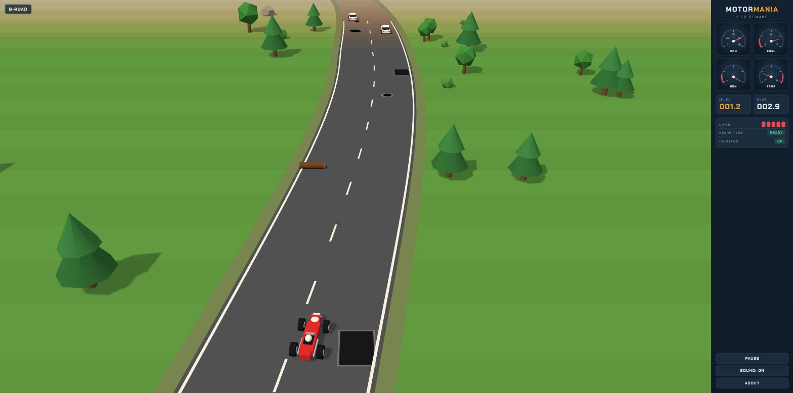
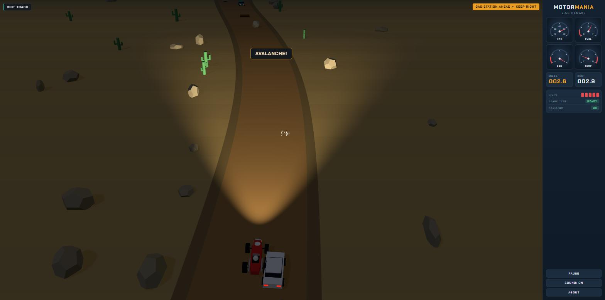
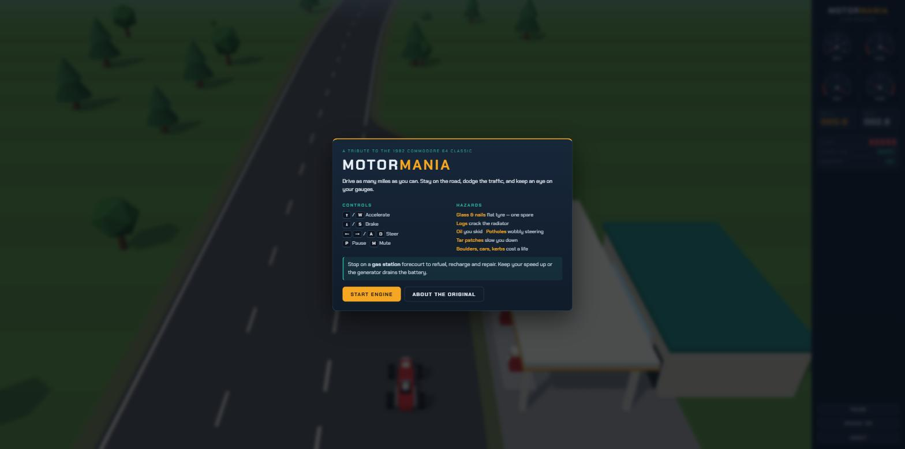

# Motormania 2.5D

A browser remake of **Motor Mania**, the 1982 Commodore 64 driving game — same rules and feel as the original, redrawn as a tilted 2.5D world with real-time lighting, shadows and a day/night cycle.

**▶ Play it: https://robertorenz.github.io/Motormania/**



| Night driving on the dirt track | Title screen at the gas station |
| --- | --- |
|  |  |

## How to play

Drive as many miles as you can on five lives. You start parked on a gas station forecourt.

| Key | Action |
| --- | --- |
| <kbd>↑</kbd> / <kbd>W</kbd> | Accelerate (up to 80 mph) |
| <kbd>↓</kbd> / <kbd>S</kbd> | Brake |
| <kbd>←</kbd> <kbd>→</kbd> / <kbd>A</kbd> <kbd>D</kbd> | Steer |
| <kbd>P</kbd> / <kbd>Esc</kbd> | Pause |
| <kbd>M</kbd> | Mute |

On phones and tablets, on-screen buttons appear automatically.

### Roads

- **Motorway** — four wide lanes, heavy traffic.
- **B-road** — two lanes, winding, a bit of everything.
- **Dirt track** — narrow and twisty, with avalanches.

### Hazards

| Hazard | Effect |
| --- | --- |
| Broken glass, nails | Flat tyre. You stop and fit the spare — you only carry one. A second puncture costs a life. |
| Logs | Crack the radiator. The temperature climbs until the engine overheats. |
| Oil | You skid with no steering for a moment. |
| Potholes | Steering goes erratic for a few seconds. |
| Tar patches | Slow you down. |
| Boulders (avalanche) | Lose a life. |
| Other cars, cross traffic, the fire engine | Lose a life. |
| The edge of the road | Lose a life. |

### Gauges

- **MPH** — speedometer, 0–80.
- **FUEL** — drops as you drive. Run dry and you lose a life.
- **GEN** — the generator only charges the battery at high speed (about 56 mph and up). Dawdle and the battery drains; at night your headlights dim with it, and a flat battery costs a life.
- **TEMP** — only rises once the radiator is damaged.

### Gas stations

Pull onto the forecourt on the right and **stop**. The station refuels the car, recharges the battery, repairs the radiator and gives you a new spare tyre. Press accelerate to leave.

## About the original

**Motor Mania** was written by **John A. Fitzpatrick** and published by **UMI (United Microware Industries)** in **1982**, the year the Commodore 64 was released — one of the first driving games for the machine.

It is a top-down, vertically scrolling endurance drive: you leave a gas station in an old-style racing car, reach up to 80 mph across motorways, B-roads and dirt tracks, and try to cover as many miles as possible with five lives. A side panel shows the speedometer, fuel gauge and generator dial alongside your mileage, lives and spare tyre. Nails and glass puncture tyres, logs damage the radiator, potholes upset the steering, road patches slow you down, avalanches roll boulders across the road, and crossroads bring cross traffic, including a fire engine.

Read more: [Motor Mania on Wikipedia](https://en.wikipedia.org/wiki/Motor_Mania_(video_game)) · [Computing History museum entry](https://www.computinghistory.org.uk/det/18135/Motor%20Mania/)

### What the remake changes

- The flat top-down view becomes a tilted 3D camera with low-poly models, shadows and fog — the long look-ahead of the original is kept.
- A day/night cycle, with headlights powered by the battery.
- A temperature gauge on the dashboard, so radiator damage is visible.
- Gas stations also restock the spare tyre.
- Synthesised engine, crash and siren sounds; touch controls; best distance saved locally.

## Credits

| | |
| --- | --- |
| Original game (1982) | John A. Fitzpatrick, published by UMI (United Microware Industries) |
| Remake | Roberto Renz |
| Rendering | [three.js](https://threejs.org/) (MIT) |
| Typeface | [Chakra Petch](https://fonts.google.com/specimen/Chakra+Petch) (SIL Open Font License) |

This is an unofficial, non-commercial fan tribute written from scratch. It contains no code, graphics or sound from the original game. Motor Mania and Commodore 64 are the property of their respective owners.

## Running locally

No build step. The game uses ES modules, so serve the folder over HTTP rather than opening the file directly:

```sh
python -m http.server 8000
# then open http://localhost:8000
```

```
index.html      page, dashboard and modals
css/style.css   layout and theme
js/main.js      game loop, rules, HUD, input
js/road.js      procedural road, stations, crossroads, chunk geometry
js/models.js    low-poly cars, hazards and scenery
js/audio.js     Web Audio sound effects
```

Add `?demo=1` to the URL for an invulnerable autopilot run (used for the screenshots above); `&tod=day|dusk|night` fixes the time of day.

## Licence

[MIT](LICENSE) © 2026 Roberto Renz
